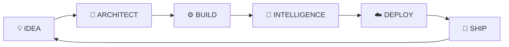

<div align="center">

# `mithunrajmr`

### **Mithun Raj M R**

<sub>Software Developer · Full-Stack Engineer · AI Builder</sub>

<br>


<br><br>

<a href="https://mithunrajmr.netlify.app">

</a>
<a href="https://linkedin.com/in/mithunrajmr">

</a>
<a href="mailto:2mrmithunraj@gmail.com">

</a>

<br><br>


</div>

<br>

---

<div align="center">

### `./whoami`

**Building at the intersection of**

`SOFTWARE`   ×   `CLOUD`   ×   `AI`

</div>

<br>

<table align="center">
<tr>

<td width="50%" valign="top">

### 🤖 AI

`Generative AI`

`Agentic Systems`

`Decision Intelligence`

`Human-in-the-Loop`

</td>

<td width="50%" valign="top">

### ⚙️ ENGINEERING

`Java`

`Spring Boot`

`React`

`Python`

`REST APIs`

</td>

</tr>

<tr>

<td width="50%" valign="top">

### ☁️ CLOUD

`Google Cloud`

`Vertex AI`

`BigQuery`

`Firebase`

</td>

<td width="50%" valign="top">

### 🧩 DATA & SYSTEMS

`PostgreSQL`

`MySQL`

`WebSockets`

`Redis`

</td>

</tr>
</table>

<br>

<div align="center">

### 🧪 Current Experiment

**How far can software go when AI becomes part of the workflow — not just the interface?**

`→`

**agents · automation · decisions · enterprise workflows**

</div>

---

# 🧰 My Stack

<div align="center">


<br><br>


<br><br>


</div>

---

# 🚀 Things I've Built

<table align="center">

<tr>

<td width="50%" valign="top">

## 🏦 TORII

### `AGENTIC / ENTERPRISE`

AI-driven branch operations with intelligent workflows, document verification, compliance, fraud detection and human approval.

**React · PostgreSQL · Redis · watsonx · Gemini**

🏆 **HackOn Agentic AI 2026 — Finalist**

<a href="https://github.com/mithunrajmr/torii">EXPLORE →</a>

</td>

<td width="50%" valign="top">

## 📊 DecisionIQ

### `AI / DECISION SYSTEM`

Inventory decision intelligence using operational data, contextual signals and AI-generated purchasing strategies.

**React · FastAPI · BigQuery · Vertex AI**

🏆 **Google Gen AI Academy APAC 2026**

<a href="https://github.com/mithunrajmr/DecisionIQ">EXPLORE →</a>

</td>

</tr>

<tr>

<td width="50%" valign="top">

## 💬 DoConnect AI

### `FULL-STACK / REAL-TIME`

A discussion platform combining Q&A, role-based access, real-time communication and AI-assisted knowledge workflows.

**Spring Boot · React · MySQL · WebSocket · Gemini**

<a href="https://github.com/mithunrajmr/DoConnect-AI">EXPLORE →</a>

</td>

<td width="50%" valign="top">

## ⚡ MR Flow

### `PRODUCTIVITY / WEB`

Workflow and productivity application for tasks, time tracking, reporting and productivity insights.

**React · Firebase**

<a href="https://mr-flow.netlify.app">LIVE →</a>

</td>

</tr>

</table>

---

<div align="center">

# 🏆 Proof, Not Claims

<br>


<br><br>

**Google Cloud Certified Partner Specialist**

`Gemini Enterprise Agent Development`

`Gemini Enterprise Deployment`

</div>

---

# 🧭 The Journey

```text
2023                 2024                 2025                 2026
 │                     │                    │                    │
 ▼                     ▼                    ▼                    ▼
Web Development   →   Software Intern   →   B.E. ISE        →   Project Engineer
Varcons               AuMDS                 DBIT                 Wipro
```

<br>

<div align="center">

### **Now →**

`Java` · `Spring Boot` · `Cloud` · `Generative AI` · `Agentic Systems`

</div>

---

# 🧠 How I Build

<div align="center">



</div>

<br>

<div align="center">

`Build → Test → Learn → Improve`

<br>

<sub>I care more about solving the problem than using the trendiest technology.</sub>

</div>

---

# 📊 GitHub

<div align="center">


<br><br>


</div>

---

<div align="center">

### `open_to = "building interesting things"`

<br>

<a href="https://mithunrajmr.netlify.app">

</a>
<a href="https://github.com/mithunrajmr">

</a>
<a href="https://linkedin.com/in/mithunrajmr">

</a>

<br><br>

**Build things. Break things. Learn things. Ship things.**

<br>


</div>
